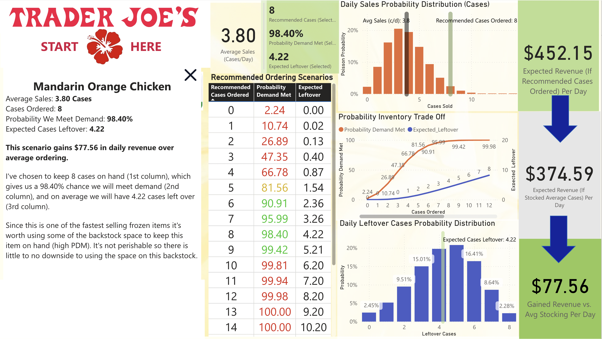

# How I Order Chips for Trader Joe's using Python, Poisson Distributions, and Power BI

## Aloha!
Thank you for checking out my product ordering report. This Power BI dashboard helps visualize Poisson-based inventory predictions for Trader Joe’s products. Users can input average daily sales to explore the likelihood of demand being met, expected leftover stock, and optimized ordering strategies.

This tool helps me when ordering products for my store. The goal is to maximize revenue. To do this we need to meet customer demand while carrying the least amount of inventory to reduce spoilage and optimize storage space. Any Trader Joe's is one big exercise in probability. **Through this report, I show how identifying as little as 15 products that are being understocked can yield around $183,000/year in gained revenue by capitalizing on our busiest days.** 

Built using Power BI with a DAX-based lookup model, the report simulates ordering scenarios to reduce spoilage and backstock. It applies a Poisson distribution to calculate optimal case quantities and visualize inventory risks.

[Please find the Power BI report here](https://app.powerbi.com/view?r=eyJrIjoiYWI0N2MyNDAtYTdkNy00YmNhLWE5N2QtMzQyOGJhMGRkNWMxIiwidCI6ImJjMzM5NDJjLTE2YjQtNDcwYS04Yjc5LTk1MmNmMzY0NmJjYiIsImMiOjZ9).

## Want to See How It’s Built?

If you're curious about how these probabilities are calculated, [check out my Jupyter notebook] where I use Python’s scipy.stats library and the Poisson function to generate the full lookup table powering this report.

## About the Data

This project is for demonstration purposes only. No private information from Trader Joe’s has been used. All average sales numbers are fictional, and the underlying lookup table relies solely on Poisson-generated distributions—not actual sales data.

## License

This repository is provided for educational and demonstration purposes only.  
All content, including Power BI reports and Python code, is © Matt Myers.  
**Commercial use, redistribution, or adaptation is not permitted without written consent.**
